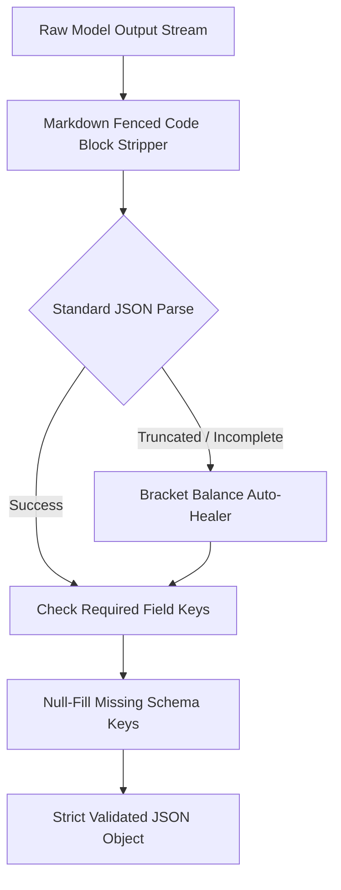

# genpark-agent-output-schema-enforcer-guardrail-skill

Agent Skill implementing **Structured JSON Output Repair & Schema Enforcement Guardrail** in 100% Python standard library.

## Architectural Flow

